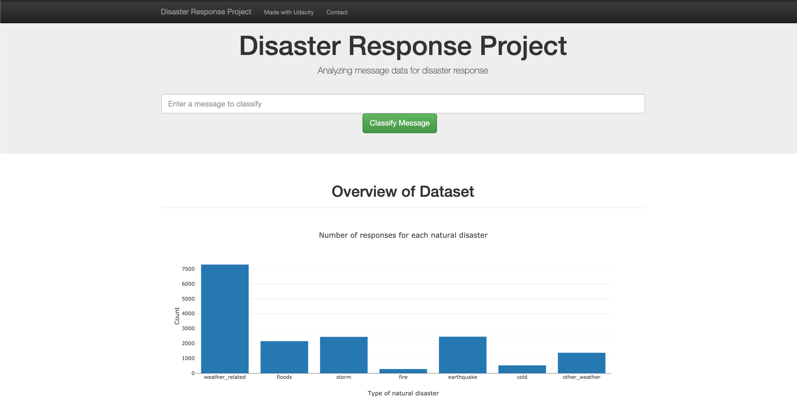

# Disaster Response Pipelines

## Overview
In this project, We'll apply various data engineering sills to analyze disaster data from [Figure Eight](https://www.figure-eight.com/) to build a model for an API that classifies disaster messages.

The project uses a data set which contains real messages that were sent during disaster events. We will be creating a machine learning pipeline to categorize these events so that we can send the messages to an appropriate disaster relief agency.

The project will also include a web app where an emergency worker can input a new message and get classification results in several categories. The web app will also display visualizations of the data. 

Below are a few screenshots of the web app.



## Project Components
There are three components we'll constitute the whole workfow of the project:

### 1. __ETL Pipeline__

In a Python script, [`process_data.py`](process_data.py), create a data cleaning pipeline that:
- Loads the messages and categories datasets
- Merges the two datasets
- Cleans the data
- Stores it in a SQLite database

### 2. __ML Pipeline__

In a Python script, [`train_classifier.py`](train_classifier.py), create a machine learning pipeline that:

- Loads data from the SQLite database
- Splits the dataset into training and test sets
- Builds a text processing and machine learning pipeline
- Trains and tunes a model using GridSearchCV
- Outputs results on the test set
- Exports the final model as a pickle file

### 3. __Flask Web App__
For this part, we'll need to:

- Add data visualizations using Plotly in the web app

## Getting Started
There were two diffrent `.csv` files used in this project: [`disaster_messages.csv`](data/disaster_messages.csv), containing the messages sent during the times of disasters and [`disaster_categories.csv`](data/disaster_categories.csv) giving the information about category of the disasters. The data sets are in their raw forms so they need some cleaning before merging and exporting the merged dataset as a sqlite database. 

### Prerequisites
All the required packages and libraries are listed in file `requirements.txt`. They can be installed in `venv` using `pip install requirements.txt`.

_`scikit-learn` (version >= 0.20) is required to successfully train the model or run the flask app_.

### Usage
1. All the tasks in ETL pipeline- from preprocessing data to storing the data in SQLite database can be done by running:

```
python process_data.py data/disaster_messages.csv data/disaster_categories.csv data/DisasterResponse.db
```

2. Training the machine learning model:

```
python train_classifier.py data/DisasterResponse.db models/classifier.pkl
```

3. Running the flask app:
   
To start the webserver, run the following command inside the app directory:
```
python run.py
```

